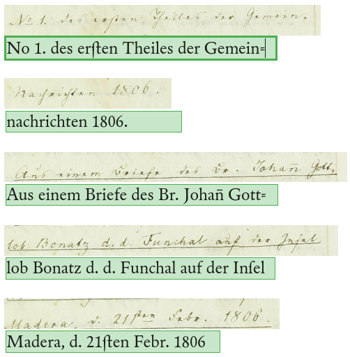
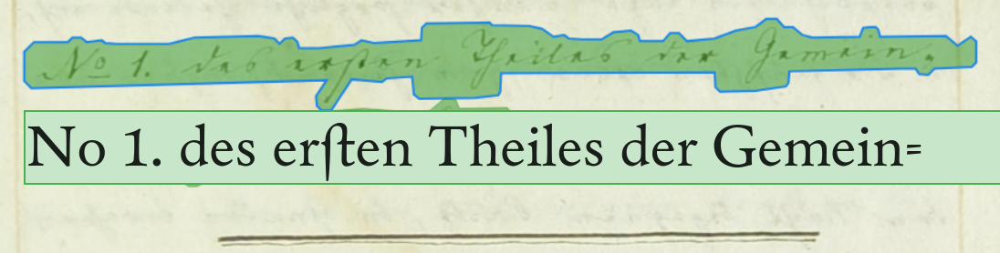
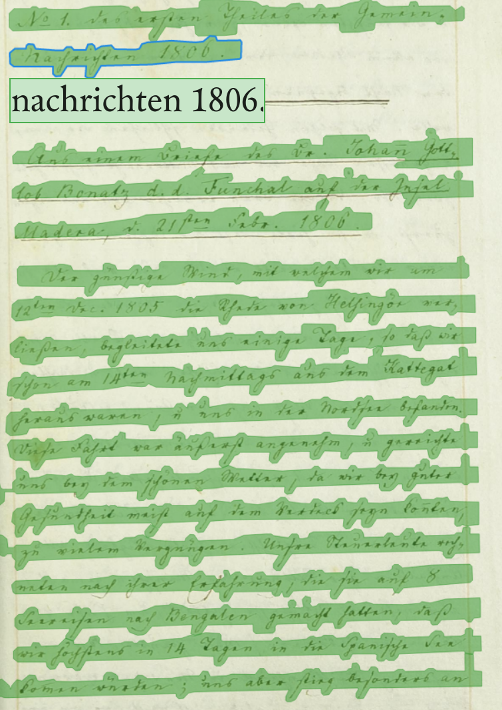
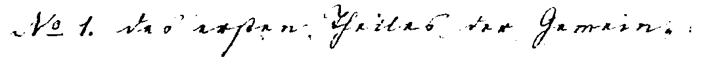

layout: true
  
<div class="my-header"></div>

<div class="my-footer">
  <table>
    <tr>
      <td style="text-align:right">Sächsische Landesbibliothek – Staats- und Universitätsbibliothek</td>
      <td>Date</td>
      <td style="text-align:right"><a href="https://www.slub-dresden.de/">www.slub-dresden.de</a></td>
    </tr>
    <tr>
      <td style="text-align:right">Referat 4.3</td>
      <td />
    </tr>
  </table>
</div>

<div class="my-title-footer">
  <table>
    <tr>
      <td style="text-align:left"><b>Kay-Michael Würzner</b></td>
    </tr>
    <tr>
      <td style="text-align:left">Referat 4.3</td>
    </tr>
    <tr>
      <td style="font-size:8pt"><b>06.08.2021</b></td>
    </tr>
    <tr>
      <td style="font-size:8pt">Digital Herrnhut in textwissenschaftlichen Kontexten</td>
    </tr>
  </table>
</div>

---

class: title-slide
count: false

# Vom Digitalisat in die virtuelle Forschungsumgebung
## Workflowetappen

---

# Überblick

- erste im Rahmen des LDP digitalisierten Materialien aus dem Unitätsarchiv Herrnhut online: https://digital.slub-dresden.de/werkansicht/dlf/435266/1/
- Ziele für heute
    + Handschriftenerkennung: Wie funktioniert's?
    + Training und *Ground Truth*
    + Struktur- und Texterfassung mit Larex

---

class: part-slide
count: false

# Handschriftenerkennung: Wie funktioniert's?

---

# Wie funktioniert's?

- Ziel: Transformation von Bilddaten in maschinenlesbaren Volltext
    + schrittweise Verarbeitung

<center>

</center>
<center>
<p>↓</p>
</center>
<center>
<p style="display: inline-block; text-align: left; font-size: 16pt.; font-style: italic;">
oberwähntem Tage mancher sorgliche Gedanke auf,<br/>
&amp; wir seufzten öfters zum Heiland, daß Er uns<br/>
vor allem Schaden, der uns etwa in der folgen-<br/>
den Nacht begegnen könnte, in Gnaden bewahren
</p>
</center>

---

# Wie funktioniert's?

- Schritt 1: Zeilenerkennung
    + **regelbasierte** (Bildmorphologie) oder
    + **datengetriebene** Verfahren (e.g. Pixelklassifikation)

<center>

</center>
<center>
<p>↓</p>
</center>
<center>

</center>

---

# Wie funktioniert's?

- Schritt 2: Vektorisierung
    + **Skalierung** auf einheitliche Höhe
    + **Unterteilung** in 1pixel-breite Streifen

<center>

</center>
<center>
<p>↓</p>
</center>
<center>

</center>

---

# Wie funktioniert's?

- Schritt 3: Textermittlung
    + **Übergangswahrscheinlichkeiten** zwischen Vektoren
    + Rückgriff auf (offline) trainiertes **Modell**

<center>

</center>
<center>
<p>↓</p>
</center>
<center>
<p style="display: inline-block; text-align: left; font-size: 16pt.; font-style: italic;">
oberwähntem Tage mancher sorgliche Gedanke auf,<br/>
&amp; wir seufzten öfters zum Heiland, daß Er uns<br/>
vor allem Schaden, der uns etwa in der folgen-<br/>
den Nacht begegnen könnte, in Gnaden bewahren
</p>
</center>

---

# Wie funktioniert's?

.cols[
.fourty[
- Schritt 3: Zeichenerkennung (Prinzip)
    + Erkennung auf Zeilenebene
    + Ausgabe der Zeichen mit höchster Wahrscheinlichkeit
]
.sixty[
<p style="margin-top:-20px">

</p>
]
]

---

# Wie funktioniert's?

- Software
    + [**Tesseract**](https://github.com/tesseract-ocr/tesseract): komplettes Open-Source-Paket
        * regelbasierte Bildvorverarbeitung und Layouterkennung
        * datengetriebene Texterkennung (unterstützt > 100 Sprachen)
        * Ease-of-Use-Training eigener Modelle
        * für OCR und **HTR** verwendbar
    + [**OCRopy**](https://github.com/ocropus/ocropy): umfangreiches Open-Source-Paket
        * regelbasierte Bildvorverarbeitung und Layouterkennung
        * datengetriebene Texterkennung (nur sehr wenige Modelle vorhanden)
        * für OCR und **HTR** verwendbar
        * prominente Ableger: [**kraken**](https://kraken.re) und [**Calamari**](https://github.com/Calamari-OCR/calamari)
    + [**OCR-D**](https://ocr-d.de/): Workflow-Engine
        * Orchestrierung verschiedener Open-Source-Pakete zu stabilen Workflows
        * gleichzeitig DFG-Förderprogramm zur Verbesserung von OCR für historische Drucke
        * SLUB als maßgebliche Entwicklungseinrichtung
    + [**LAREX**](https://github.com/OCR4all/LAREX): GT-Erstellung
        * Webapp zur Annotation von Struktur und Text (Transkription)

---

class: part-slide
count: false

# Training und *Ground Truth*

---

# Training und *Ground Truth*

- Basis der Erkennung: **trainierte** Modelle
    + anhand manuell erstellter, fehlerfreier Trainingsdaten
- für Text:
    + Paare von Zeilenbildern und deren Text
- für Struktur (Regionen und Zeilen):
    + Seitenbilder und Koordinaten der Struktureinheiten
- Algorithmus lernt Zuordnung
    + Wahrscheinlichkeitsverteilung über mgl. Zeichen und Zeichentrenner
- bei ausreichender Menge und **Repräsentativität** der Daten → verbesserte Erkennung

---

# Training und *Ground Truth*: Beispiel

.cols[
.fourty[
- Herrnhut Nachrichten 1806 (&gt;800 Seiten)
- GT-Erstellung mittels LAREX (z.Z. 15 Seiten)
   
]
.sixty[


]
]

---

# Training und *Ground Truth*: Beispiel

- keine existierenden HTR-Modelle  
   → Transkription von Grund auf  
   → Pretraining mit großem existierendem GT  
     z.B. [Konzilsprotokolle Universitätsarchiv Greifswald](https://zenodo.org/record/215383#.YJFuPHVfjDs) (8770 Zeilen)  
     
---

# Training und *Ground Truth*: Beispiel

- Training und Test mit Tesseract
   * Basis: HTR Konzilsprotokolle  
     
    ```
    $ make training MODEL_NAME=htr MAX_ITERATIONS=30000
    $ tesseract htrline1.png - -l htr --psm 13 --dpi 300
    sowohl, als auch eb bei der Schrift etwas zu er-
    ```
   * Finetuning: HTR Herrnhut  
     
    ```
    $ make training START_MODEL=htr MODEL_NAME=hetjens MAX_ITERATIONS=3000
    $ tesseract hetjens-no1.png - -l hetjens --psm 13 --dpi 300
    e1 de erten. hrieo der Geme une
    ```

---

# Training und *Ground Truth*: Beispiel

- Evaluierung (extern):

| **Daten** | **Modell** | **CER (%)** |
| --- | --- | --- |
| Konzilsprotokolle (train) | htr | ? |
| Konzilsprotokolle (val) | htr | ? |
| Herrnhut (train) | htr+hetjens | 5.0 |
| Herrnhut (val) | htr+hetjens | 35.7 |

---

# Training und *Ground Truth*: Optimierungen

- Ergebnis des Experiments: **hochspezifisches** Modell
    + Aufwand im Allgemeinen nicht leistbar
- Optionen
    + **Transfer-Learning**
        * Anpassung eines existierenden, ähnlichen Modells mit wenigen Zeilen GT auf spezifische Vorlage
    + **generische Modelle**
        * auf Basis großer Mengen diversen GTs trainierte Modelle mit Allgemeinheitsanspruch 
        * schwierig im Bereich HTR
    + **synthetisches Training**
        * mit Hilfe großer Textmengen und verschiedener Computerschriftarten automatisch erzeugter GT
        * Erzeugung einer realistischeren Optik durch
    + **Augmentierung**
        * größere Modellrobustheit und Variantenstabilität durch gezieltes Verrauschen
        * Schrägstellung, Spiegelung, Störpixel, horizontale und vertikale Verzerrung etc.

---

class: part-slide

# Struktur- und Texterfassung mit Larex

---

# Struktur- und Texterfassung mit Larex

- Webapplikation für bequeme/schnelle Transkription
    + Struktur- und Textebene
- bereits am Institut für Germanistik im Einsatz


---

class: part-slide

# Diskussion und lose Enden

- verlässliche, automatische Handschriftenerkennung in Reichweite
- Digital Herrnhut
    + ...
- GT-Problematik
    + gemischtes Vorgehen
        * existierende Kurrentdatensätze als Grundlage
    + „echte“ Ground Truth für NBG
        * Larex zur Transkription
        * Podcasts zur indirekten Transkription
        * Einbindung von Bürgerwissenschaftlerinnen und -wissenschaftler sowie Studierende
    + synthetische Ground Truth
        * gute Kurrentschriften gesucht!


---

class: part-slide

# Vielen Dank für Ihre Aufmerksamkeit

<center>
<a href="https://wrznr.github.io/dhh-text-2021/">wrznr.github.io/dhh-text-2021/</a>
</center>
